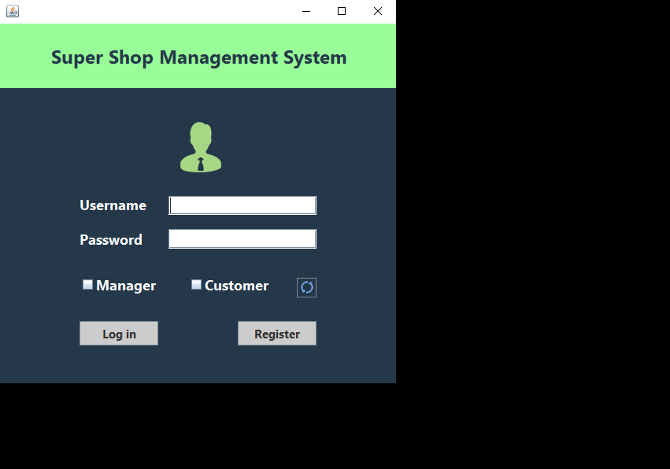
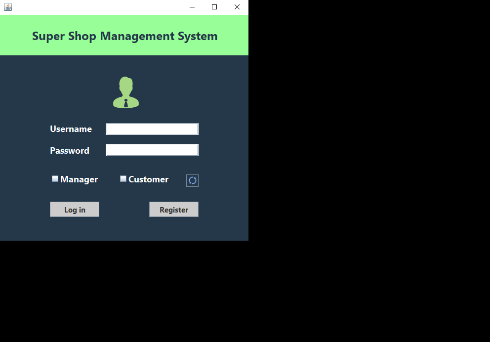

## Supershop-Management-System
It's a desktop application implemented as a term project of CSE 2100 using Java Swing & MySql.   This software is for maintaing a supershop. It will be useful to the manager of the shop to maintain items which are available in the stock. Also a customer can create an account, log in and order product in order to buy, and when it is done, an invoice will be generated automatically with the details of the order.  Finally, customer will have the option to rate the service of the shop.  

|    Manager    |   Customer    |
| ------------- | ------------- |
| Sign in                  | Create account and Sign in |
| Stock Management         | Search products  |
| View sales information   | View products by category|
| Add, delete & update products | Order products  |
| View ratings             | View total bill  |

###  `Project Sample`  

### Manager Part

### Customer Part

